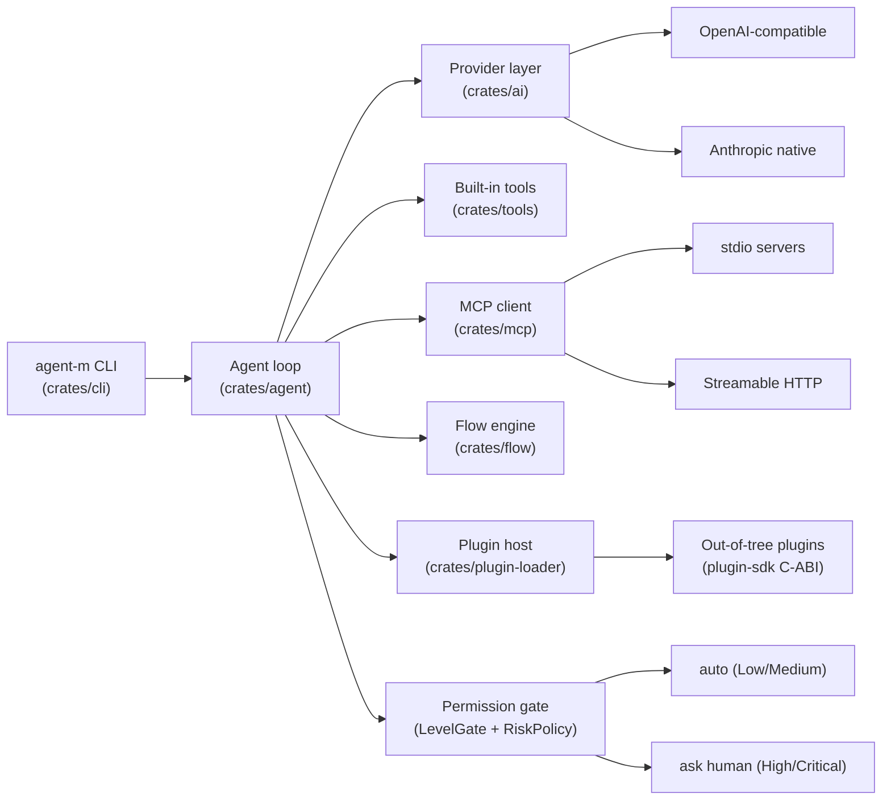
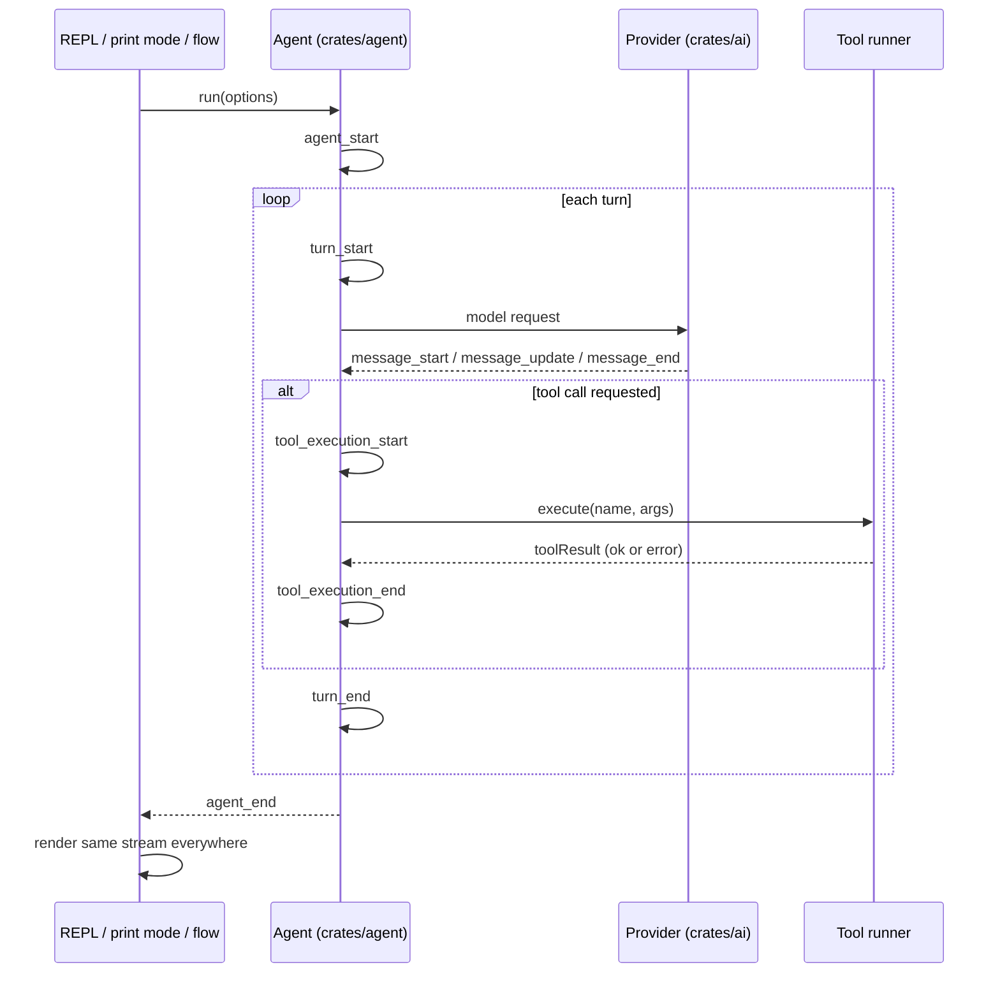

# Architecture

A cargo workspace of focused crates, mirroring pi's layered design:

```
crates/ai      model-agnostic provider layer, byte-stable serializer, cache stats
crates/agent   agent loop (pi event ordering), session messages, tool trait, permission gate
crates/tools   built-in tools (bash, read, write, edit, grep, find, ls, search, web)
crates/flow    YAML flow engine (prompt/ask/tool/condition/phase/verify steps, ${ref}s)
crates/cli     the agent-m binary (args, config, print mode, interactive REPL)
crates/mcp     MCP client (stdio + Streamable HTTP)
crates/plugin-sdk     C-ABI contract for out-of-tree plugin tools
crates/plugin-loader  libloading-based plugin host (loads, validates, wraps tools)
```

Plus the example plugins under `plugins/` (`fixture`, `jira`, `github`,
`bitbucket`, `test-runner`).

## System view



## The agent loop

The agent emits events in pi's ordering — `agent_start → turn_start →
message_start/update/end → tool_execution_* → toolResult → turn_end →
agent_end` — so the REPL, print mode, and flows all render the same stream.
Errors fold into `StreamEvent::Error` / `StopReason::error|aborted`; they are
never thrown across the stream boundary.



## Byte-stable prefix caching

The design goal is that the provider's context cache serves every turn instead
of recomputing the prefix:

- Request bodies are serialized **deterministically** — sorted JSON object
  keys, no volatile fields (timestamps, random ids).
- The system prompt (including the trust instruction and any "Known
  preferences" block) and the tool schemas are assembled **once per session**
  and never change.
- Only the new user message is appended per turn; messages are never rewritten
  in place.

Cache hit/miss tokens (`prompt_cache_hit_tokens` /
`prompt_cache_miss_tokens`) are parsed into `CacheStats` and shown by
`/usage` in the REPL.

## Sessions and memory

- Conversations persist as JSONL under
  `~/.agent-m/agent/sessions/--<cwd>--/` and auto-resume; every entry is
  timestamped (trust principle 7).
- `/compact` summarizes older messages into a `[session summary]` entry that
  stays in context — pi's cross-session memory model. `--compact-threshold`
  (default 0.5) compacts at turn boundaries, not mid-implementation.
- The plan file (`~/.agent-m/agent/tasks/<session>.json`) is a second durable
  memory. `preferences.json` is a third (`!command` families, `/undo`
  signals): `/undo` usage is recorded and reflected back as a "Known
  preferences" prompt block; the `!command` signal has no code path yet
  (see `TRUST_AUDIT.md`).

## Providers

The provider layer is model-agnostic: any OpenAI-compatible chat-completions
endpoint works via `OpenAiCompatibleProvider` (configurable base URL + model).
DeepSeek is configured out of the box — `deepseek-chat` (default) and
`deepseek-reasoner` (thinking deltas) — and the key resolves from
`~/.agent-m/agent/auth.json` → `~/.agent-m/agent/settings.json` (provider-key
env vars are not read).
