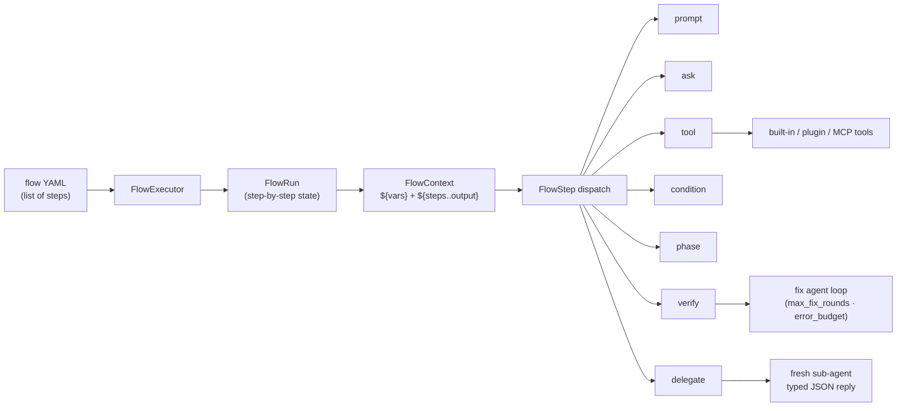

# Flows (Devin-style pipelines)

`agent-m --flow flows/agentic-dev.yml --yes` runs a YAML pipeline of steps with
a shared `FlowContext` and `${ref}` references. `/flow <path>` runs
one interactively and `/flows` lists the flows in `~/.agent-m/flows/`.



## Step types

| Type | What it does |
|------|--------------|
| `tool` | Runs a built-in or plugin tool (`tool: bash`, `tool: jira-search`, …) |
| `prompt` | Runs the agent with a message; `mode: plan` restricts it to read-only tools |
| `ask` | Pauses for a human answer (flows need a human for `ask`; see `--yes`) |
| `condition` | Branches on a context value (e.g. `${steps.check.output.isError}`) |
| `phase` | A fresh-context execution phase (the GSD loop's Execute phase) |
| `verify` | Runs a command and loops fixes up to `max_fix_rounds` (bounded by the flow's `error_budget`) |
| `delegate` | Runs a fresh structured sub-agent that MUST reply with a single JSON object (see below) |

Steps run sequentially; a failed step aborts the flow with a clear message.
Steps share outputs through `${steps.<name>.output}` (and dotted paths like
`${steps.check.output.isError}`), plus seeded context values such as
`${ticket}` and `${repo}`.

## Structured sub-agent step (`delegate`)

A `delegate` step is a **typed delegation**: the `prompt` runs in a brand-new
sub-agent (fresh context window, own turn budget, tool subset) that is told
to reply with **only a single JSON object** — no prose, no markdown fences.

```yaml
- type: delegate
  name: analysis
  prompt: "Map the entrypoints and rate the risk of this change."
  schema:
    type: object
    required: [risk, entrypoints]
    properties:
      risk: { type: string }
      entrypoints: { type: array, items: { type: string } }
  tools: [read, search]     # optional: restrict the sub-agent's tools
  max_turns: 6              # optional: sub-agent turn budget (default 4)
  on_invalid: stop          # optional: `continue` keeps the flow on bad JSON
```

The sub-agent's reply is parsed and stored so downstream steps can reference
**real fields** (not prose):

- `${steps.analysis.output.json.risk}` → `"low"`
- `${steps.analysis.output.json.entrypoints}` → `["src/main.rs"]`
- `${steps.analysis.output.content}` → the pretty-printed JSON text
- `${steps.analysis.output.isError}` → `false`

```yaml
- type: tool
  name: echo-risk
  tool: bash
  arguments:
    command: "echo ${steps.analysis.output.json.risk}"
```

The schema (when given) is embedded in the sub-agent's system prompt as a
conformance hint; the agent does its best to obey it. If the reply does not
parse as JSON the step fails with `delegate: sub-agent did not produce valid
JSON; got (first 200 chars): …` — the flow aborts unless
`on_invalid: continue`. `delegate` never nests: the sub-agent's own tool set
excludes `delegate`, and it runs one trust level down from its caller.

## Fix loop + error budget

The `verify` step runs its command, and while it fails it hands the **failure
output to a fix agent** (the prompt includes the command, the failing output,
and how many fix rounds remain) and re-runs the command. Two things bound the
loop:

- `max_fix_rounds` (per step, default 3) — how many fix attempts one verify
  step gets.
- `error_budget` (flow level, optional) — a cap on the **total** fix rounds
  across every verify step in the run, so a flow with several verify steps
  can't burn unbounded model calls.

When either cap is hit the step **stops-and-reports**: it fails with a message
like `fix budget exhausted (used 5 of 5 fix rounds); last failure: …` (the
last failure output is included so the report is actionable), and the flow
aborts — ship/close-out steps never run on a red verify. The step output also
carries `fix_rounds`, `max_fix_rounds` and `budget_exhausted` for
`${steps.<name>.output}` references.

## The canonical example

The shipped `flows/agentic-dev.yml` is the GSD phase loop — Discuss → Plan →
Execute → Verify → Ship → Close out (Jira In Review + PR comment). Seed the
context inputs (`ticket`, `repo`, `transitionId`) with `--flow-context`:

```bash
agent-m --flow flows/agentic-dev.yml --yes \
  --flow-context ticket=PROJ-42 \
  --flow-context repo=acme/app \
  --flow-context transitionId=31
```

```mermaid
flowchart TD
    A[jira-ticket<br/>fetch ${ticket}] --> B{workspace<br/>${worktree} == true?}
    B -- no --> C[clone<br/>git clone ${repo} work]
    B -- yes --> D[skip clone<br/>already in checkout]
    C --> E[discuss · plan mode<br/>research + numbered Plan]
    D --> E
    E --> F[ask review-plan<br/>Approve the plan?]
    F -- no --> X[flow aborts]
    F -- yes --> G[execute · phase<br/>fresh context implements plan]
    G --> H{verify-env<br/>${worktree} == true?}
    H -- no --> I[verify<br/>cd work && cargo test]
    H -- yes --> J[verify<br/>cargo test in place]
    I --> K[fix loop<br/>max_fix_rounds 3 · budget 5]
    J --> K
    K -- red & exhausted --> X
    K -- green --> L[ask review-implementation]
    L -- no --> X
    L -- yes --> M[pr · github-create-pr]
    M --> N[transition · jira-transition<br/>In Review]
    N --> O[comment · jira-comment<br/>PR link]
```

```yaml
error_budget: 5   # total fix rounds across all verify steps

steps:
  # Discuss: fetch the ticket and the repo
  - type: tool
    name: jira-ticket
    tool: jira-search
    arguments:
      query: "${ticket}"
  - type: tool
    name: clone
    tool: bash
    arguments:
      command: "git clone ${repo} work"

  # Plan: research → numbered Plan → human review
  - type: prompt
    name: discuss
    mode: plan
    message: |
      Ticket: ${steps.jira-ticket.output.content}
      Summarize the key implementation decisions for this ticket.
  - type: ask
    name: review-plan
    question: "Approve the plan? ${steps.plan.output}"

  # Execute: implement the approved plan (fresh context per prompt step)
  - type: phase
    name: execute
    prompt: |
      Implement the approved plan. ${steps.plan.output}
      Use the edit/write tools. Run the tests when done.

  # Verify: run the tests, loop fixes up to 3 rounds (error_budget caps all)
  - type: verify
    name: verify
    command: "cd work && cargo test"
    max_fix_rounds: 3

  # Ship: raise the pull request
  - type: tool
    name: pr
    tool: github-create-pr
    arguments:
      title: "${ticket}"
      body: "Closes ${ticket}\n\nPlan: ${steps.plan.output}"

  # Close out: move the ticket to In Review, link the PR
  - type: tool
    name: transition
    tool: jira-transition
    arguments:
      key: "${ticket}"
      transitionId: "${transitionId}"
  - type: tool
    name: comment
    tool: jira-comment
    arguments:
      key: "${ticket}"
      body: "PR ready for review: ${steps.pr.output.content}"
```

The `jira-*` and `github-create-pr` steps are plugin tools — install them
with `agent-m plugins install <repo>` (see [Plugins](/plugins/overview)).

## Worktree mode (`agent-m pickup`)

The same flow runs under [`agent-m pickup`](/usage/pickup) in **worktree
mode**: pickup resolves the ticket + repo, creates an
`agent-m/<ticket>-<ts>` worktree branch, and runs the flow inside that
checkout with `ticket`, `repo`, and `worktree=true` seeded. The flow
branches on it (a `condition` step):

- workspace: `git clone ${repo} work` (standalone) vs. an in-place echo —
  the worktree already is the checkout;
- verify: `cd work && cargo test` (standalone) vs. `cargo test` at the
  checkout root.

Both branches keep the same step names (`clone`, `verify`), so downstream
references like `${steps.verify.output}` resolve identically either way.

## Safety and state

- Flow `tool` and `verify` steps go through the permission gate and the
  destructive-command rules: High/Critical calls are denied (flows have no
  human to ask unless the `ask` step provides one).
- Each run writes `STATE.md` + `CONTEXT.json` state artifacts under
  `~/.agent-m/flows/<name>/`, so progress survives restarts.
- Prompt steps get a **fresh context** (a new agent instance), so each phase
  starts clean with exactly what its prompt references — no context rot across
  a long pipeline.
