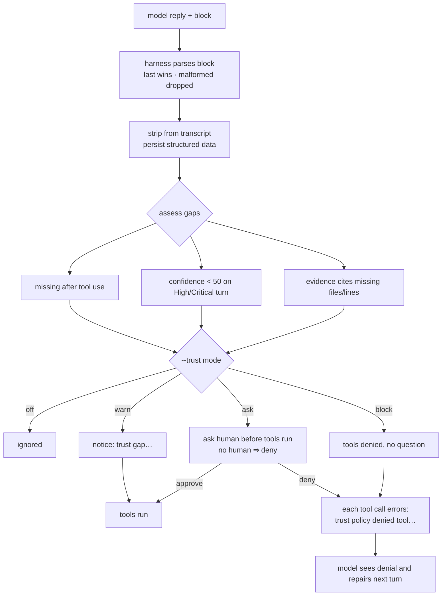

# The twelve trust principles

agent-m targets the twelve trust principles from `check.md` ("Building Trust in
an AI Harness"). The split is deliberate: **the harness — never the LLM —
decides what is safe.** The model only *reports* (reason, confidence, evidence);
the harness *enforces* (risk tiers, approvals, audit).

Status reflects the **current tree** (verified against code, not docs): the
trust block machinery, risk classification, and journal are real; risk-based
permissions, meaningful interruptions, and autonomy levels are fully wired;
undo and preference learning are half-wired (checkpoints and `!command`
learning are the missing halves). See `TRUST_AUDIT.md` for the file-by-file
evidence.

| # | Principle | Status | In agent-m |
|---|-----------|--------|------------|
| 1 | Transparency | Partial | Tool narration in the REPL — `Reading src/app.rs…`, `Running \`cargo test\`…` — instead of a bare spinner |
| 2 | Explain every decision | **Yes** | The model may end each reply with a `<trust>` block; when present the REPL renders it as a "── decision ──" block (reason, outcome). **Enforced with `--trust`**: a turn that uses tools without a `<trust>` block is noticed (`warn`), asked about (`ask`), or denied (`block`) — see [Enforcement](/trust/principles#enforcement) below |
| 3 | Show the plan before execution | Partial | `--mode-plan` (or `/mode plan`) produces a numbered plan (`Plan:` list); the plan's `<plan>` items + `<estimated_time>` appear in the decision block. Plans gate nothing — the agent can run tools without one |
| 4 | Confidence scoring | **Yes** | 0-100 `<confidence>`, parsed and displayed (color-coded by tier) in the decision block. **Enforced with `--trust`**: below the threshold (default 50) a turn that also touches High/Critical tools escalates to the human |
| 5 | Risk-based permissions | Yes | Four harness-assigned tiers — Low / Medium / High / Critical — classified by `RiskPolicy` and enforced by `LevelGate` in both interactive modes: Low/Medium auto, High/Critical ask |
| 6 | Meaningful interruptions | Yes | Consequence framing ("This can destroy data…") in the approval prompt; only High/Critical interrupt; `--yes` cannot silence them |
| 7 | Complete audit trail | Partial | Every session entry is timestamped; `/journal` renders the narrated timeline (time, action, outcome) |
| 8 | Reversible actions | Partial | `/undo` is live — `write`/`edit` targets are snapshotted before execution and restored on request. `/checkpoint` and `/restore` are still stubs; `create_checkpoint`/`restore_checkpoint` remain unwired |
| 9 | Evidence-driven conclusions | **Yes** | `<evidence>` items render as `file:line — note` citations when present. **Enforced**: citations are checked against the working directory (missing files, out-of-range lines) — reported at the REPL and folded into the trust gap that `--trust` notices/asks/blocks |
| 10 | Honest uncertainty | Partial | `<uncertainty>` notes are shown in the decision block when present |
| 11 | Learn user preferences | Partial | `prefs.rs` feeds the "Known preferences" system-prompt block from `/undo` usage. The second signal (`!command` families) has no code path — there is no `!` command in the REPL |
| 12 | Progressive autonomy | Yes | `--level <0-4>` selects the startup `LevelGate` level; `/level N` changes it live; `/level` reports the current tier by name |

## How the trust block works

The system prompt instructs the model to end each reply with a machine-readable
`<trust>` block. The harness parses it (last block wins; malformed blocks are
dropped, never fatal), strips it from the transcript text, persists the
structured data in the session, and renders the decision block.

```xml
<trust>
<confidence>85</confidence>
<reason>Expired JWT tokens are not validated.</reason>
<expected_outcome>Expired sessions will now be rejected.</expected_outcome>
<evidence><item file="auth.ts" line="83">no expiry check</item><item file="login.test.ts">failing test</item></evidence>
<uncertainty>Verified against the local tests only; not load-tested.</uncertainty>
<plan><item>Inspect logs</item><item>Update middleware</item><item>Run tests</item></plan>
<estimated_time>45 seconds</estimated_time>
</trust>
```

## Enforcement

The trust block is not just decoration. With `--trust <mode>` the harness
acts on the gaps the model leaves behind — the harness, not the model,
decides (default `warn`):



| Mode | Missing `<trust>` after a tool-using turn | Confidence below threshold (default 50) on a High/Critical turn | Evidence citing missing files/lines |
|------|------------------------------------------|-----------------------------------------------------------------|-------------------------------------|
| `off` | ignored | ignored | shown only |
| `warn` | `[Notice] trust gap: …` | `[Notice] trust gap: …` | `[evidence] …` at the REPL |
| `ask` | human asked before the tools run | human asked before the tools run | folded into the ask prompt |
| `block` | tools denied, no question | tools denied, no question | folded into the denial |

Denied turns never run their tools: each call becomes an error result
(`trust policy denied tool …`), so the model sees the denial and can repair
the block on its next turn. `ask` without a human (headless, no `--slack-channel`)
denies by default — no human to ask is treated as denial, the same safe
default as the risk gate.

```sh
agent-m --trust warn                      # default: notice gaps
agent-m --trust ask --slack-channel C05…  # remote human decides
agent-m --trust block                     # hard enforcement
```

See [Risk tiers](/trust/risk-tiers) for how the harness classifies tool calls and
[Autonomy](/trust/autonomy) for how much it lets the agent do on its own.
