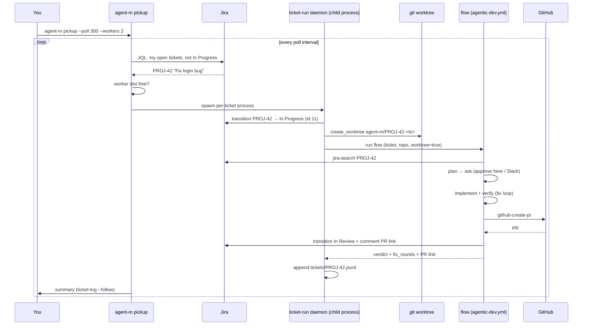

# Auto-pickup

`agent-m pickup` is the first step of the autonomous SDLC loop: it picks up
the next Jira ticket assigned to you, moves it **In Progress**, creates an
isolated **worktree branch**, and runs a flow against it with `${ticket}` and
`${repo}` pre-seeded — then it's one command from ticket to PR.



A failed ticket kills only its own daemon — the supervisor keeps polling.

```bash
# One ticket, one run:
agent-m pickup

# Stay running: pick a new ticket every 60s until Ctrl-C:
agent-m pickup --poll 60

# Bare --poll uses the default schedule (300s):
agent-m pickup --poll

# Work a backlog in parallel: up to 3 flows at once, one worktree per ticket:
agent-m pickup --poll 300 --workers 3

# See what it would do, without touching anything:
agent-m pickup --dry-run

# Explicit ticket / repo (skip the Jira query and repo mapping):
agent-m pickup --ticket PROJ-42 --repo https://github.com/acme/app.git
```

## Parallel workers

`--workers N` (with `--poll`) runs up to N ticket flows **in parallel**, one
fresh worktree per ticket — drain a backlog instead of serializing it. A
supervisor acquires a worker slot, picks the next ticket not already in
flight, and hands it to a worker task; failures are reported per ticket and
the loop keeps going. `--workers` defaults to `1` (serial, the classic
behavior), and an explicit `--ticket` always runs serially.

Double-picking is prevented twice: the default JQL now excludes
`In Progress`, and the supervisor keeps an in-flight set covering the window
before a worker's transition lands.

## Per-ticket daemons

Under `--workers N` each ticket is handed to its **own `agent-m ticket-run`
child process** — a per-ticket daemon — rather than an in-process task:

- **Isolation** — a ticket's crash, panic, or provider error never takes
  down the supervisor or sibling tickets; the supervisor keeps polling.
- **Tailable reports** — every daemon appends a JSONL report to
  `~/.agent-m/agent/tickets/<KEY>.jsonl` as it goes (pickup → live step
  transitions → final verdict with fix-rounds and PR link). Watch any
  ticket from another terminal:

  ```sh
  agent-m ticket-log PROJ-42            # current state
  agent-m ticket-log PROJ-42 --follow   # tail live while it runs
  ```

- **Reusable body** — `agent-m ticket-run --ticket PROJ-42 --repo <R>` runs
  the same one-ticket pipeline (transition → worktree → flow → report)
  standalone; it exits `0` on success and `1` if any flow step failed, which
  is what the supervisor reports.

Slack oversight stays **channel-based and in-process** (see
[`agent-m slack`](/cli/reference#slack)): DM-triggered pickups run with the
channel as the approvals/progress surface. The per-ticket daemons are the
terminal `--poll --workers` path.

## What it does

1. **Pick** — query Jira for your open tickets (default JQL:
   `assignee = currentUser() AND status not in (Done, Closed, Canceled,
   In Progress) ORDER BY updated DESC`). The most recently updated ticket
   wins; tickets already In Progress (e.g. a failed flow) are not re-picked.
2. **Resolve the repo** — the ticket's project key (`PROJ-42` → `PROJ`) is
   looked up in the mapping file (below). A `--repo` override wins.
3. **In Progress** — transition the ticket via
   `POST /rest/api/3/issue/{key}/transitions` (transition id `11` by default,
   override with `--transition-id`).
4. **Worktree branch** — reuse [`create_worktree`](/usage/sessions-worktrees):
   a fresh `agent-m/PROJ-42-<ts>` branch with a checkout under
   `~/.agent-m/agent/worktrees/`.
5. **Run the flow** — runs your flow inside that checkout with
   `ticket`, `repo`, and `worktree=true` seeded. Because the checkout is
   already the repo, the flow's clone step is skipped and verify runs
   in-place (`cargo test` at the checkout root instead of `cd work && cargo test`).

`--dry-run` prints the whole plan (ticket, repo, worktree, transition, flow,
context) and exits — no side effects, no network writes.

## Repo mapping: `~/.agent-m/agent/repos.json`

Pickup maps a Jira **project key** to a git URL or local path:

```json
{
  "PROJ": "https://github.com/acme/app.git",
  "PLAT": "/work/plat"
}
```

A local path works too — great for fixtures and monorepos. The file lives at
`~/.agent-m/agent/repos.json`; a missing file yields a clear error naming the file
(and `--repo` as the escape hatch).

## The flow

The default flow is `flows/agentic-dev.yml` (override with `--flow`). The
same flow runs two ways:

| | Standalone `--flow` | `pickup` |
|---|---|---|
| workspace | `git clone ${repo} work` | already in the worktree checkout |
| verify | `cd work && cargo test` | `cargo test` |
| seeded context | `ticket`, `repo`, `transitionId` | `ticket`, `repo`, `worktree=true` + yours |

Pass flow-context values the same way as `--flow`:
`agent-m pickup --flow-context transitionId=31 --poll 300`.

## Slack DM trigger

The same loop is available over Slack: run
[`agent-m slack`](/extending/slack) and DM it `pick up PROJ-42` (or bare
`pickup` to auto-pick). The flow runs with Slack as the oversight channel —
questions, High/Critical approvals, and step progress land in that DM — and
a summary with the PR link is posted when it finishes.
