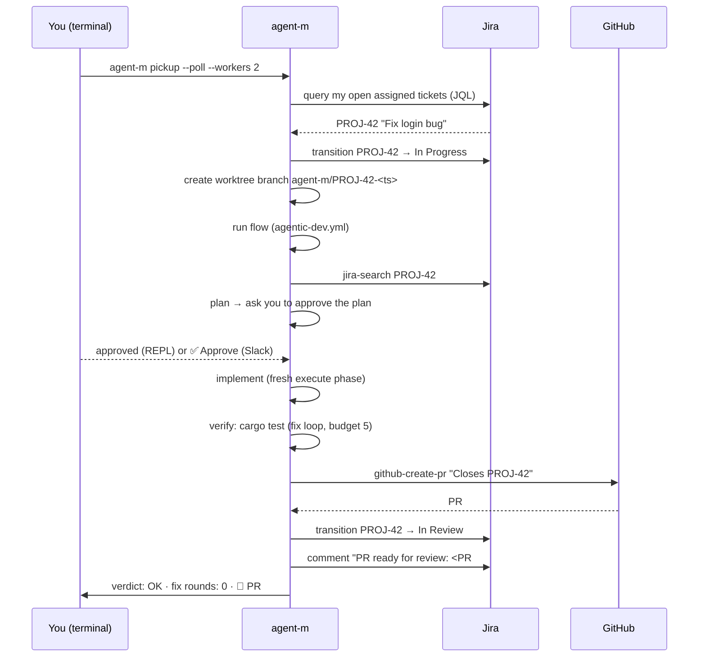

# End-to-end tutorial: ticket → PR

This walkthrough takes you from a blank machine to **agent-m autonomously
moving a Jira ticket through implementation and raising a pull request** —
one command at a time, with what you should see at each step. It assumes
nothing beyond being able to paste commands into a terminal.

If you don't have Jira/GitHub yet, jump to
[Try it with fake data](#try-it-with-fake-data) — the same commands work with
a local git repo and a hand-picked ticket.

## The big picture



That's the whole loop. The rest of this page makes it real.

## Step 0 — Install

```bash
curl -LsSf https://raw.githubusercontent.com/aekutetechnologies/agent-m/main/install.sh | sh
```

`agent-m` lands in `~/.local/bin/` (add that to your PATH if the installer
asks). No Rust required. Verify:

```bash
agent-m --help
# …prints the flag list, ending with subcommands: plugins, slack, pickup, ticket-run, ticket-log
```

## Step 1 — Give it a brain

Create your API key file (this is the **only** place keys are read from —
see [Templates](/templates/index#authjson--your-api-keys)):

```bash
mkdir -p ~/.agent-m/agent
printf '{"deepseek": "sk-YOUR-KEY"}\n' > ~/.agent-m/agent/auth.json
```

Test the brain:

```bash
agent-m -p "say hello in one word"
# hello
```

If you get a missing-key error, check `~/.agent-m/agent/auth.json` exists
and has valid JSON.

## Step 2 — Connect Jira + GitHub

agent-m reads credentials from environment variables for these plugins:

```bash
export JIRA_URL="https://yourcompany.atlassian.net"
export JIRA_TOKEN="<your Jira API token>"
export GITHUB_TOKEN="<a PAT with repo scope>"
```

(put these in your shell profile so pickup runs don't forget them). Also
install the plugins — they're separate repos:

```bash
agent-m plugins install https://github.com/aekutetechnologies/agent-m-plugin-jira
agent-m plugins install https://github.com/aekutetechnologies/agent-m-plugin-github
agent-m plugins list
```

## Step 3 — Tell pickup which repo each project maps to

Pickup needs to know that tickets under `PROJ` belong to `acme/app`:

```bash
printf '{"PROJ": "https://github.com/acme/app.git"}\n' > ~/.agent-m/agent/repos.json
```

## Step 4 — Dry run (no side effects)

The safe way to check the wiring — prints the plan, touches nothing:

```bash
agent-m pickup --dry-run
```

What you should see:

```
plan: pick PROJ-42 ("Fix login bug") → transition to In Progress
      → worktree agent-m/PROJ-42-<ts> → run flows/agentic-dev.yml
      (repo: https://github.com/acme/app.git)
```

A missing `repos.json` entry or unset `JIRA_URL` shows a clear error naming
the file — fix that and re-run.

## Step 5 — The real thing: one ticket

```bash
agent-m pickup
```

You'll see, in order:

1. **Query + transition** — it picks your most recently updated open
   assigned ticket and moves it to In Progress.
2. **Worktree** — a fresh `agent-m/PROJ-42-<ts>` branch is created and the
   flow runs inside it, so your main checkout stays untouched.
3. **The flow** — steps print as they run: `jira-ticket`, `clone`, `discuss`,
   `plan`, … The plan step pauses to ask you: **"Approve the plan?"** —
   answer `y`/`n` (or approve over Slack if you added `--slack-channel`).
4. **Verify** — the flow runs `cargo test`; on red it hands the failure to a
   fix agent (up to 3 rounds, capped by the flow's `error_budget: 5`) and
   re-runs.
5. **Ship + close out** — `github-create-pr` raises the PR, then Jira moves
   the ticket to In Review and comments the PR link.

End of run, the terminal shows the step-by-step verdict. Exit code 0 = the
PR exists.

## Step 6 — Watch it work unattended

Two flavors:

**Drain your backlog, in parallel** (a new child process per ticket):

```bash
agent-m pickup --poll 300 --workers 3
```

**Tail a specific ticket's report** (from another terminal):

```bash
agent-m ticket-log PROJ-42            # current state
agent-m ticket-log PROJ-42 --follow   # live tail
```

```text
12:01:03 pickup PROJ-42 — Fix login bug
12:01:04 [running] verify
12:02:11 [succeeded] verify
12:02:14 verdict OK (fix rounds: 2) 🔗 https://github.com/acme/app/pull/7
```

## Step 7 — Remote control over Slack (optional)

With Socket Mode credentials, `agent-m slack` runs as an orchestrator: DM
it **`pick up PROJ-42`** and it runs the whole pickup, reporting the verdict
back in the channel — plan approvals and High/Critical security prompts also
arrive as Slack messages with Approve/Deny buttons. See
[Slack remote channel](/extending/slack).

## Try it with fake data

No Jira? You can still walk the loop:

1. Make a tiny local git repo and a repos.json mapping that points at it:

```bash
mkdir -p /tmp/demo && cd /tmp/demo && git init -q && echo "fn main(){}" > main.rs && git add . && git commit -qm init
printf '{"DEMO": "/tmp/demo"}\n' > ~/.agent-m/agent/repos.json
```

2. Point Jira at a throwaway URL and let pickup use an explicit ticket
   (it skips the Jira query, so only the transition fails — harmlessly):

```bash
export JIRA_URL="https://nope.invalid" JIRA_TOKEN="x"
agent-m pickup --ticket DEMO-1 --repo /tmp/demo --dry-run
```

3. Or run the flow directly with seeded context — no Jira at all:

```bash
cd /tmp/demo
agent-m --flow flows/agentic-dev.yml --yes \
  --flow-context ticket=DEMO-1 --flow-context repo=/tmp/demo
```

The flow's worktree branch keeps `else` paths (`git clone ${repo} work`),
so run it from a folder where the repo already exists and the verify step
runs `cargo test` in place. Expected: clone is skipped, plan runs (plan
mode, read-only), execute + verify iterate, and the PR/close-out steps fail
with "unknown tool" (no GitHub/Jira plugins) — which is exactly the safe
behavior to expect before plugins are installed.

## Troubleshooting the tutorial

| Symptom | Fix |
|---------|-----|
| `command not found: agent-m` | `echo 'export PATH="$HOME/.local/bin:$PATH"' >> ~/.zshrc && source ~/.zshrc` |
| `No LLM providers are configured…` | `settings.json` was deleted/emptied — re-run any command; the starter template is re-created |
| `pickup needs JIRA_URL…` | `export JIRA_URL=… JIRA_TOKEN=…` (Step 2) |
| `no repo mapping for project 'X'` | add `"X": "<git-url>"` to `~/.agent-m/agent/repos.json` |
| `unknown tool 'jira-search'` | `agent-m plugins list` — install the jira/github plugins (Step 2) |
| Flow aborts at `verify` | read the stop-and-report: it includes the last failure output — fix, or raise `error_budget` |
| `did not produce valid JSON` (delegate step) | sub-agent replied with prose; retry, or set `on_invalid: continue` |

More: [FAQ](/getting-started/faq), [Checks & verification](/checks/verification).
